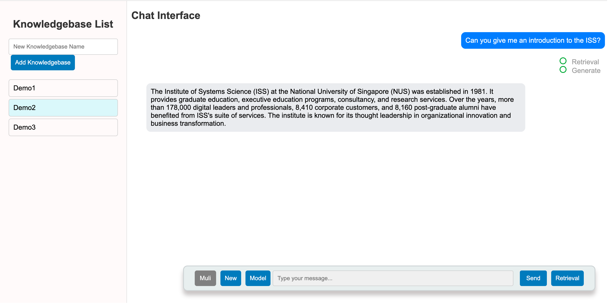

## Archive Flow: Intelligent Retrieval-Augmented Generation Assistant



---

## SECTION 2 : EXECUTIVE SUMMARY / PAPER ABSTRACT
In an increasingly data-driven world, efficient and accessible information management is paramount for both businesses and individuals. ArchiveFlow, as a Retrieval-Augmented Generation (RAG) system, addresses this need by enhancing archiving processes through advanced document management and retrieval capabilities. This system combines retrieval and generation technologies to streamline the storage, classification, and retrieval of documents, aiming to reduce the time spent searching for information and improve overall productivity.

Our team designed ArchiveFlow with a modular architecture, incorporating both a front-end user interface and a robust back-end, developed using the Sanic framework, and supported by a Milvus vector database and MySQL for data management. The backend autonomously processes uploaded files by categorizing and indexing them using machine learning and pre-configured rules. By embedding documents with the BCE-embedding-base_v1(NetEase Open Source) model into a 768-dimensional vector space, ArchiveFlow enables rapid and accurate retrieval of relevant documents using Milvus, followed by reranking and context expansion to ensure comprehensive results. This two-stage search process optimizes the system’s speed and accuracy, significantly enhancing user experience.

To support high data loads, ArchiveFlow includes robust load balancing, user management, and permissions settings that ensure data security and scalability. Each user can create and manage personalized knowledge repositories, tailored to their specific information needs, allowing more efficient document organization and retrieval.

As ArchiveFlow evolves, future improvements may include more intelligent AI-driven classification, expanded cloud service integration, and customizable system configurations. We invite stakeholders to explore the potential of ArchiveFlow to meet their document management and retrieval needs, whether in small-scale personal applications or larger corporate environments.

---

## SECTION 3 : CREDITS / PROJECT CONTRIBUTION

| Official Full Name  | Student ID (MTech Applicable)  | Work Items (Who Did What)                                                                                                                                                                                                                                                                                                                                                                                                                           | Email (Optional) |
| :------------ |:---------------:|:----------------------------------------------------------------------------------------------------------------------------------------------------------------------------------------------------------------------------------------------------------------------------------------------------------------------------------------------------------------------------------------------------------------------------------------------------| :-----|
| Wang Wenjie | A0296855H | **(Full Stack)**<br/>**Back-end**: Development of service layer and relevant SDKs such as the file parsing module, model manager module and etc; system architecture design;<br/>**Front-end**: Interface enhancement and optimization;<br/>**Server Operations**: Deployment of the entire system on the server, database design and management;<br/>**Other work**:System Architecture Description Video,  Optimization the final team report and | E1350993@u.nus.edu |
| Wu Zhengxi | A0296199E | **Back-end**: Development of Relevant APIs, such as database instructions and file management, LLMs chat and etc; The workflow from file content parsing to vector embedding and storage in the database<br />**Front-end**: Interface enhancement and Optimization;<br />**Other work**: Video of System Promotion                                                                                                                                 | e1350337@u.nus.edu |
| Sun Yanshu | A0296705U | **Front-end**:Website design including Login, chat interface and File management pages, completing relevant js scripts these pages used,  Interface enhancement and optimization.<br />**Back-end**:Development of  the URL scraping in file parsing module.<br />**Other work**:Final team report and user guide; mapped system functionalities against knowledge                                                                                  | e1350843@u.nus.edu |

---

## SECTION 4 : VIDEO OF SYSTEM MODELLING & USE CASE DEMO

### Promotion Video of Archive Flow

[](https://www.youtube.com/watch?v=fzYRbQtPjWk)

### System Framework in Archive Flow

[](https://www.youtube.com/watch?v=kHboWkzAx4A)

---

## Install

We have set up a website to help you quickly experience Archive Flow! 🚀 [Click here](http://47.108.135.173) to start your journey! 🌟

*Note:This website is hosted on a server in China, so you may experience network lag if accessing it from outside the country.*

#### 0. Requirements

1. Docker and Docker compose

2. Python >= 3.9

3. install the requirements

   ```bash
   pip install -r requirements.txt
   ```

#### 1. Start Database

Make sure you have installed **Docker** and **Docker Compose**. You can refer to the [Docker Installation Guide](https://docs.docker.com/compose/install/) for detailed instructions.

After installing Docker, run the following command:

```bash
docker compose up -d 
```

In some versions of Docker you may need to run:

```bash
docker-compose up -d
```

#### 2. Start Backend

If your database and backend are on the same device, simply change `CONNECT_MODE=local`in `[SystemCode/configs/database.py]`. 

If they are on different devices, update the host and port of your database in `[SystemCode/configs/database.py]` and set `CONNECT_MODE=remote`.

You could start the Backend with just one command

```bash
python be_start.py
```

If you run the backend for the first time, it may take some time to download the relevant models. While the models are downloading, feel free to grab a coffee!

#### 3. Start Frontend

One command as well

```bash
python fe_start.py
```

#### 4. Enjoy  Archive Flow

You can view the website at [http://127.0.0.1:18876](http://127.0.0.1:18876).

---
## SECTION 6 : PROJECT REPORT / PAPER

`Refer to project report at Github Folder: ProjectReport`

**Recommended Sections for Project Report / Paper:**

1. **PROJECT OVERVIEW** 
2. **BUSINESS CASE AND MARKET RESEARCH**   
  2.1. BUSINESS CASE   
  2.2. MARKET RESEARCH 
3. **SYSTEM DESIGN AND MODEL**   
  3.1. DATA LAYER   
  3.2. SERVER LAYER   
  3.3. PRESENTATION LAYER   
4. **SYSTEM DEVELOPMENT AND IMPLEMENTATION**   
  4.1.DEVELOPMENT TOOLS AND TECHNOLOGIES
  4.2. IMPLEMENTATION PHASE   
  4.3. CHALLENGES ENCOUNTERED 
5. **FINDINGS AND DISCUSSION**   
  5.1. KEY FINDINGS  
  5.2. LIMITATION    
6. **CONCLUSION AND FUTURE WORK**   
  6.1. CONCLUSION   
  6.2. FUTURE WORK   
7. **APPENDICES** 
  
